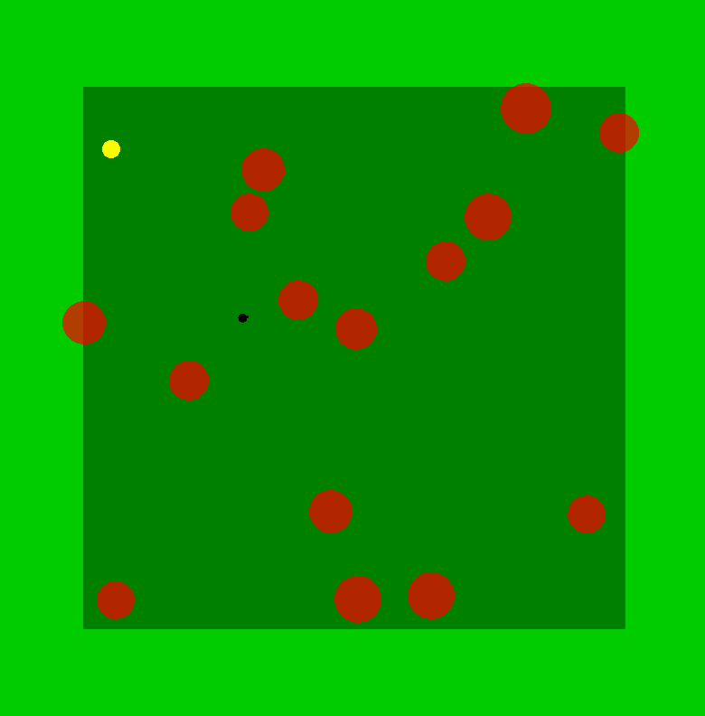
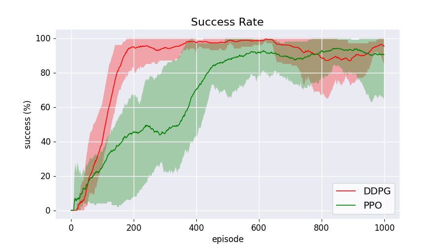
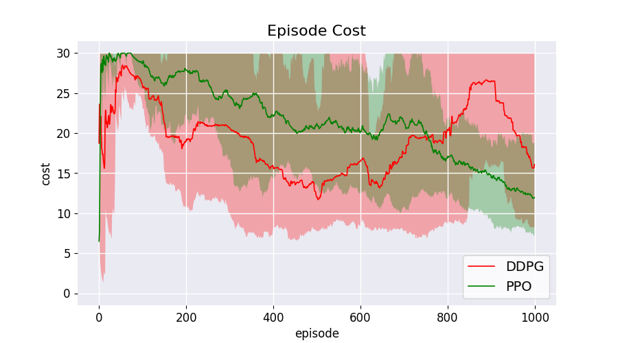

### Disclaimer:
This is a **work in progress repo**, there may be bugs in the code and numerous typos in the README file.

# SafeRL
A set of algorithms and environments to train SafeRL agents, written in TensorFlow2 and OpenAI Gym.
Safety is expressed as a cost function to minimize while the objective is to maximize the success rate, number of success over 100 consecutive trials.

- This repo contains a simplified and **free** version of the [safety gym environments](https://github.com/openai/safety-gym) that does not require [MuJoCo](http://www.mujoco.org/) .
- This repo contains an implementation of Proximal Policy Optimization (PPO) for discrete environments and of Deep Deterministic Policy Gradient (DDPG) for the continuous environments.
- This repo contains an implementation of Interior-Point Policy Optimization (IPO) for discrete environments under the safety constraints.
- **WIP:** This repo **(will)** contain other implementation of different algorithms for SafeRL with the benchmark as baseline.

## Environments
To install the environments clone the repo and then use 
```
git clone https://github.com/d-corsi/SafeRL.git
cd SafeRL
pip install -e environments
```

To run the environments, import the package and then use `gym.make`. There are two versions of the environment, the first is with a discrete action space, the second one with a continuous action space. 
```
import gym
env = gym.make( "light_safety_gym:point_discrete-v0" )
env = gym.make( "light_safety_gym:point_continuous-v0" )
```



## Environments Details:

- The objective of the agent is to reach the goal (yellow shpere) avoiding the obstacles red sphere. 
- The environment returns in the **info dictionary** the informations about the current state. 
- At each step, if the agent is inside an unsafe state (i.e., inside the red sphere) the cost flag **info['state_cost']** is equals to 1.
- At the end of the episode if the agent reaches the goal (i.e., the yellow sphere) the flag **info['goal_reached']** is equals to 1.
- We considered the task solved if the success rate is greater than **95** on 100 consecutive trials.
- We consider the agent safe if the episode cost is less than **15** for 100 consecutive trials.

```
new_state, reward, done, info = self.env.step(action)
episode_cost += info['state_cost']
episode_success = info['goal_reached']
```

## Run the Baseline
To reproduce our results use the test.py script:
```
python test.py -PPO_discrete
# or
python test.py -DDPG_continuous
# or
python test.py -IPO_discrete
```

To render the enviroment during the training (this will slow down the training phase!), modify the following line:
```
DDPG( env=env, verbose=2, render=False )
# to
DDPG( env=env, verbose=2, render=True )

PPO( env=env, verbose=2, render=False )
# to
PPO( env=env, verbose=2, render=True )
```

if the flag **verbose** is set to 2, the algorithm save the results (success and cost) on a.txt file inside the folder **data**.

## Baseline Results

To plot our results run the plotter script (that search for the .txt data with the results inside the data folder) as follow:
```
python plotter/plot.py
```

### Success Rate:
The task is solved by our baseline in around 200 episode with DDPG and around 800 with PPO:



### Episode Cost:
The cost function is plotted with a mximum value of 100. Simple DDPG and PPO can not optimize the cost, so the baseline can not generate a **safe** agent.




## Customize the enviornment
To customize the environment it is possible to pass different parameters to the kwargs arguments of the **env = gym.make( env_name, \*\*kwargs )** function, for example:
```
world_size [default: 800] # size of the map
spawn_size [default: 670] # size of the spawn area inside the map

agent_size [default: 5] # size of the agent
goal_size [default: 10] # size of the goal

max_linear_velocity [default: 5] # maximum linear velocity
min_linear_velocity [default: 2] # minimum linear velocity
angular_velocity [default: 0.3] # angular velocity

lidar_length [default: 15] # maximum length of the lidar scan
lidar_density [default: 12] # number of lidar scan
render_lidar [default: False] # render the lidar flag

obstacle_number [default: 18] # number of obstacle on the map
obstacle_size [default: [20, 70]] # possible size for the obstacle
```

NB: the objective and the maximum cost for the benchmarks are calibrated on the default parameters.

## Authors

* **Davide Corsi** - davide.corsi@univr.it

## License

- **MIT license**
- Copyright 2021 © **Davide Corsi**.